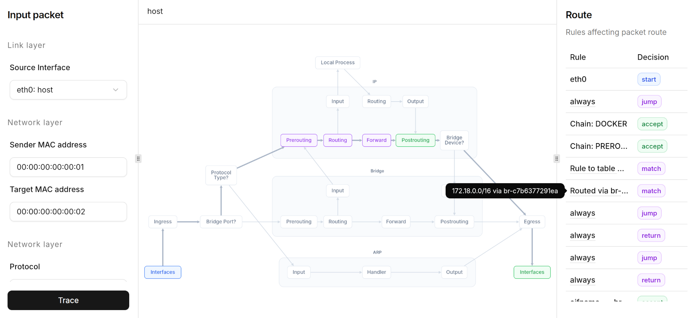

# Linux network simulation tool
[Online demo](http://81.26.184.231)!

A simulation and visualization framework that illustrates packet behavior across the Linux network stack.

### Installation
We use a backend-frontend architecture where the backend scrapes information from the server and provides it to the frontend.
#### Backend
1. Download Python/Go backend from [Releases](https://github.com/Gunter-Q12/lns/releases/latest)
2. Run it on your server

#### Frontend
1. Download single-file frontend from [Releases](https://github.com/Gunter-Q12/lns/releases/latest)
2. Open in browser
3. Input link to backend

### Usage
* Nodes are interactive, you can click them to see more info about rules they contain
* Enter packet data and click trace to see which rules affect the packet (tip: you do not need to fill all fields if you feel they are irrelevant for your case)
